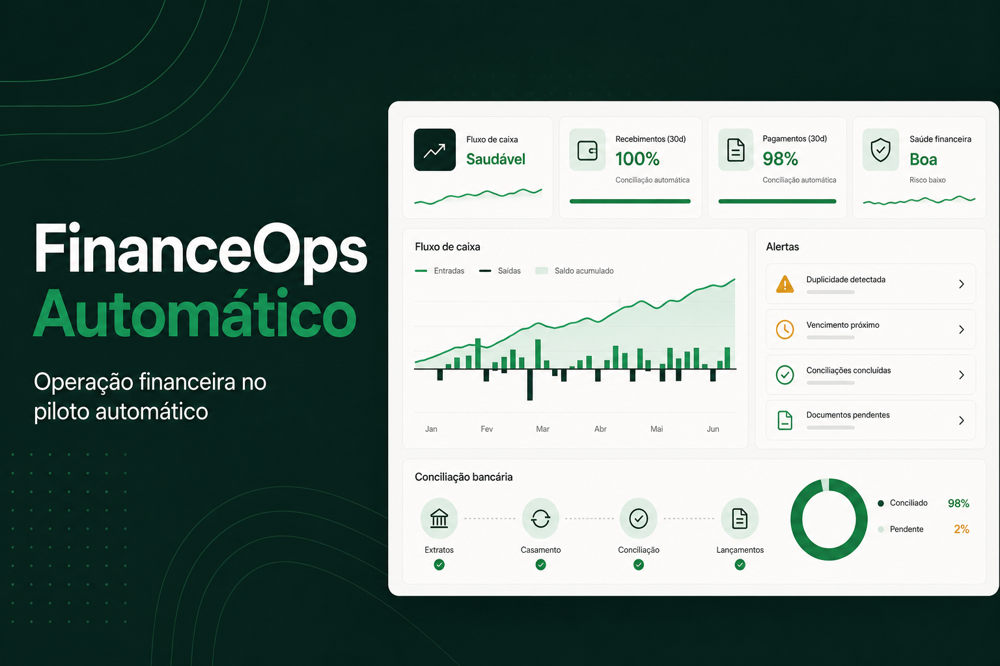

# FinanceOps Automático

MVP demonstrável de uma plataforma multiempresa para operação financeira. Centraliza contas a receber e pagar, carteira de clientes e fornecedores, cobrança simulada, projeção de caixa, conciliação bancária, alertas, automações e auditoria.



> O projeto usa uma camada de dados demo em memória para abrir sem infraestrutura e inclui a modelagem PostgreSQL/Prisma e seed completo para o ambiente persistente.

## Stack

- Next.js 16, React 19 e TypeScript
- Tailwind CSS 4 + CSS de aplicação
- PostgreSQL 16 e Prisma ORM
- Zod para validação de payloads
- Docker Compose para o banco local
- API Routes para consultas e comandos

## Destaques

- Arquitetura multiempresa com isolamento por `company_id`.
- Dataset brasileiro realista e reproduzível.
- Regras de cobrança, caixa, alertas e conciliação separadas da interface.
- APIs consistentes e ações financeiras auditáveis.
- Execução imediata em modo demo, sem depender de serviços externos.

## Início rápido

Requisitos: Node.js 22+, pnpm e Docker.

```bash
cp .env.example .env
docker compose up -d
pnpm install
pnpm db:generate
pnpm db:migrate --name init
pnpm db:seed
pnpm dev
```

A aplicação abre em `http://localhost:3000`. O dashboard funciona mesmo sem PostgreSQL usando o snapshot demo gerado de forma determinística.

### Login demo

- `admin@financeops.demo`
- `financeiro@financeops.demo`
- `aprovador@financeops.demo`
- `viewer@financeops.demo`
- Senha para todos: `Demo@123`

## Dados fictícios

O gerador em `lib/demo-data.ts` cria uma história financeira relativa ao dia de execução:

- 1 empresa e 5 usuários;
- 30 clientes e 20 fornecedores;
- 100 contas a receber e 80 contas a pagar;
- 150 transações bancárias;
- 38 eventos iniciais de cobrança;
- 24 alertas, 16 execuções automáticas e 42 logs de auditoria;
- lançamentos pagos, pendentes, aprovados e vencidos;
- matches automáticos, divergências, duplicidades e transações não identificadas.

Os valores estão em reais e cobrem mensalidade, projeto pontual, consultoria, implantação, suporte e SaaS, além das categorias de despesas solicitadas.

## Arquitetura

```text
app/
  api/                  rotas HTTP por domínio e comandos explícitos
  login/                autenticação demo
  page.tsx              composição do produto
components/
  financeops-app.tsx    shell e telas funcionais
lib/
  api.ts                envelope consistente de respostas
  demo-data.ts          dataset determinístico
  services.ts           regras de negócio e automações
  store.ts              repositório demo em memória
  types.ts              contratos de domínio
prisma/
  schema.prisma         modelo PostgreSQL multiempresa
  seed.ts               persistência do dataset no PostgreSQL
orchestration/          exemplos de fluxos Kestra e eventos n8n
docs/                   arquitetura e catálogo de API
```

Fluxo de dependências: tela → API Route → serviço de domínio → repositório. O `company_id` está presente nas tabelas operacionais e deve ser obtido da sessão no caminho de produção; nunca aceite `company_id` arbitrário enviado pelo cliente.

## Módulos implementados

- Dashboard com KPIs, projeção, inadimplência, rankings e alertas críticos
- Contas a receber com filtros, baixa e cobrança simulada
- Contas a pagar com filtros, aprovação e pagamento
- Clientes e fornecedores com consolidados financeiros
- Régua D-3, D0, D+2, D+7 e D+15 e histórico de eventos
- Fluxo de caixa diário, semanal e mensal
- Conciliação bancária com seis tipos de resultado
- Alertas com severidade, status e resolução
- Execução manual das quatro automações simuladas
- Logs operacionais e trilha de auditoria
- Login demo e papéis preparados no banco

## Retornos da API

Sucesso:

```json
{ "success": true, "data": {}, "meta": { "total": 10 } }
```

Erro:

```json
{ "success": false, "error": { "code": "VALIDATION_ERROR", "message": "Status inválido" } }
```

O catálogo completo está em [docs/API.md](docs/API.md).

## Comandos

```bash
pnpm dev           # desenvolvimento
pnpm build         # build de produção
pnpm lint          # análise estática
pnpm test          # contratos mínimos do projeto
pnpm db:generate   # gera o Prisma Client
pnpm db:migrate    # cria/aplica migração local
pnpm db:seed       # popula os dados demo
pnpm db:studio     # interface de inspeção do banco
```

## Segurança e caminho de produção

- Senhas persistidas pelo seed com bcrypt; a senha pura existe apenas na API demo.
- Cookies de sessão são `httpOnly`, `sameSite=lax` e `secure` em produção.
- Payloads de comandos são validados com Zod.
- Pagamentos e execuções possuem chaves de idempotência no modelo.
- Alertas usam `fingerprint` único para impedir duplicidade.
- Credenciais de integrações têm campo dedicado para ciphertext; tokens nunca devem ir ao frontend.
- O MVP deve receber middleware de autorização por papel antes de uso real. As permissões recomendadas estão em [docs/ARCHITECTURE.md](docs/ARCHITECTURE.md).

## n8n e Kestra

O n8n entra na borda de integração: webhooks, WhatsApp/e-mail, CRM, ERP e notificações. O Kestra executa rotinas agendadas e em lote: importações, conciliação, snapshots e relatórios. Exemplos executáveis/adaptáveis estão em `orchestration/`.

## Evolução do frontend

O frontend atual é um sistema operacional responsivo, com navegação, tabelas, filtros, estados e ações reais contra as APIs demo. As oportunidades de evolução estão documentadas em [docs/FRONTEND_GUIDE.md](docs/FRONTEND_GUIDE.md).
